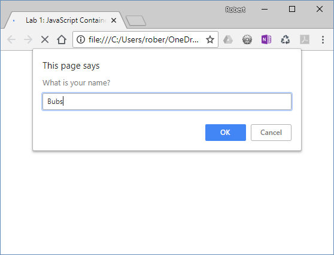
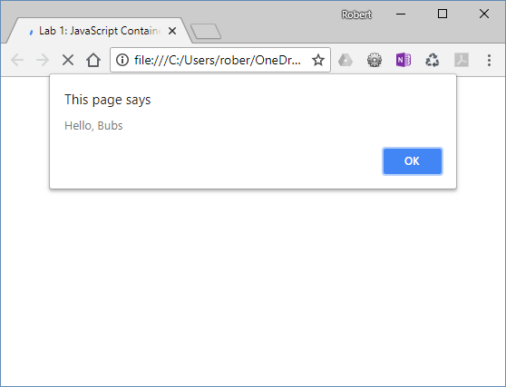

# Lab 1: JavaScript Container
*Due: Thursday, September 6, 2018 (updated)* 

Your assignment is to create a basic HTML document (webpage) and some embedded JavaScript that runs when the document is loaded in a web browser.

## Step 1: Create an HTML document

In your file system (your Mac or Windows desktop, your thumb drive, or wherever you want to do your work):

- [ ] Create an HTML document - the filename must be **lab01.html** ...exactly like that, all lowercase

In the HTML Document (lab01.html):
- [ ] Insert a valid HTML5 structure like this...

```html
<!doctype html>
<html lang="en">
<head>
	<meta charset="utf-8">
	<title></title>
</head>
<body>

</body>
</html>
```

- [ ] Set the **title** to: `Lab 1: JavaScript Container`
- [ ] Add dummy content
  - Add a **heading, level 1** with the text `Lab 1: JavaScript Container`
  - Add a **paragraph** of *lorem ipsum* text

## Step 2: Add a JavaScript element

In the HTML document:

- [ ] Add a **script** element directly above the closing **body** tag
- [ ] In the script element, write a JavaScript statement to pop-up an "alert" dialog box with a message

## Step 3: Attach an external JavaScript document

In the HTML Document:

- [ ] Add another **script** element - place it in-between other script element (above) and the closing **body** tag
- [ ] In the new script element, add a **source** ("src") and point it to: `scripts.js`

Back in the file system (wherever you're working):

- [ ] Create a new JavaScript document - the filename must be **scripts.js** ...exactly like that, all lowercase

In the external script document (scripts.js):

- [ ] Write a JavaScript statement to pop-up an "alert" dialog box with a *different* message

Test the HTML document in a web browser.  Notice that the two alert messages pop-up *in the order they are in the HTML document.*  (That'll be important to remember as we do more and more complicated programming later in the course.)

- [ ] *After* you've confirmed that your two alert messages work, comment-out both alert statements (because they're annoying)

## Step 4: Add another JavaScript element

In the **script.js** file:

- [ ] Under the second commented-out alert() code (in the external script.js file) write another JavaScript statement that uses both: `alert()` and `prompt()` and the *concatenation* operator: `+` ...in one statement (line) to prompt the user to enter their name like this:
  
  <br>...and then have the program display the user's name like this:<br>
  


## Step 5: Get credit

To get credit for this lab assignment:

- [ ] Compress (ZIP) your two files (lab01.html and scripts.js) and upload the ZIP file to **Lab 1: JavaScript Container** in Blackboard.

Note, KEEP YOUR LAB 1 FILES!!!  The first instruction for Lab 2 is to make a copy of Lab 1, so you need to hold onto those files.