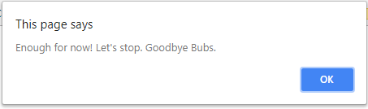

# Lab 2: Variables, Conditionals, and Functions
*Due: Tuesday, September 11, 2018*

Your assignment is to demonstrate your understanding of variables, conditionals, and functions in JavaScript.

## Step 1: Setup the HTML document

- [ ] Make a copy of your Lab 1 files (lab01.html and scripts.js); rename the HTML file: **lab02.html**

*Hint: from now on keep each set of lab files in their own folders.  "Lab 01", "Lab 02", et cetera*

In the HTML Document (lab02.html):

- [ ] Edit both the **title** and the **heading, level 1** to say: `Lab 2: Variables, Conditionals, and Functions`
- [ ] Delete the first **script** element - the one with the one **alert()** statement
- You can leave the **SCRIPT** element that links to the external **scripts.js** file as-is - you'll need it for this lab
- [ ] Delete *contents* of the third **SCRIPT** element - the one directly above the closing **body** tag - leave the opening and closing **SCRIPT** tags as-is - you'll need them for this lab; you're going to write new/different JavaScript in there

In the external JavaScript document (scripts.js):

- [ ] Delete the **alert()** statement and its comment tags

## Step 2: Ask the user some questions

In the HTML Document (lab02.html), in the **script** element directly above the closing **body** tag:

- [ ] Write a statement that **prompt**s the user to enter their name and then assign whatever they write to a variable (you pick the variable's name)<br> 
- [ ] Write another statement  (**confirm**) using the user's name to ask if they'd like to play a game.  Assign their decision to another variable<br> 
- [ ] Create an **if** statement that uses the user's decision as the criteria.  If the decision *is equal to* **true** then run a function named **playGame()** (you haven't created that function yet, but you will).
- [ ] **else** if the user's decision was **false**, then write a statement using the user's name that gives the user a conciliatory message <br> 

## Step 3: Write a game in a function

In the external JavaScript document (scripts.js):

- [ ] Create a function named **playGame()** that plays a game like this...
- [ ] Write a statement (**confirm**) that asks the user (by name) if they'd like to play again.  Assign their decision to another variable<br> 

Note: the while loop you'll write next does *not* use an incrementer.  Read carefully to see how the while loop's criteria will be changed...

- [ ] Create a **while** loop that uses the user's decision as the criteria.  While the decision *is equal to* **true** then write a statement (another **confirm**, inside the while loop) that gives the user a choice to continue (OK) or stop (Cancel).  
- [ ] Whatever the user selects, update the variable you used in the criteria. So, if the user clicks OK, they see another confirm dialog box like this...<br> 
- If the user chooses to stop the game (Cancel) then the while loop will automatically stop (the program will "drop through" the while loop)

- [ ] When the while loop exits (because the user clicked Cancel), display another message (**alert**) that uses the user's name and says goodbye<br> 

## Step 5: Get credit

To get credit for this lab assignment:

- [ ] Compress (ZIP) your two files (lab02.html and scripts.js) and upload the ZIP file to **Lab 2: Variables, Conditionals, and Functions** in Blackboard.

Remember: continue to KEEP YOUR LAB FILES saved!!!  

## Hints

The following is "pseudo code", written in comments to help you structure your program.

In the HTML file, in the **script** element (the one directly above the closing **body** tag):

```html
<script>
    // Prompt the user to enter their name 
    
    // Ask the user (by name) if they'd like to play a game
    
    // Create an if statement that uses the user's decision as the criteria 
    //   If OK then run a function named playGame()
    //   Else give the user a conciliatory message
    
</script>
```

In the **script.js** file:

```html
// Create a function named playGame()
//    Ask the user (by name) if they'd like to play again

//    Create a while statement that uses the user's decision as the criteria
//      Based on the user's answer, ask the user if they want to continue playing;
//      as long as the user says OK, then continue to play (stay in the loop)

//    When the user wants to stop (Cancel) give the user a good by message
```
